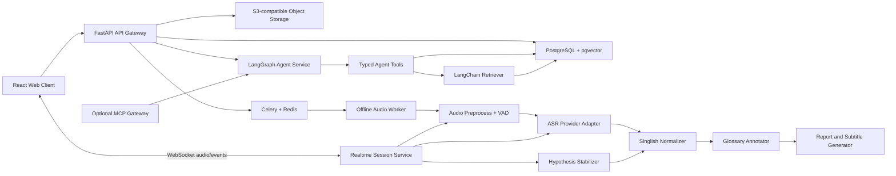

# Singlish Speech Intelligence Agent 项目总体规划

## 1. 文档目的

本文档定义一个面向实习求职展示、同时具备真实落地价值的 Singlish 语音理解项目。它用于统一产品范围、技术架构、接口、质量指标、实施阶段和展示方式，后续开发以本文档为总体依据。

项目不以堆叠 Agent 框架为目标，而以可运行 Demo、可复现实验、清晰工程边界和可量化改进为核心。语音处理使用确定性流水线，Agent 仅负责需要动态检索、工具选择和上下文推理的增强场景。

## 2. 项目定位

### 2.1 项目名称

**Singlish Speech Intelligence Agent**

### 2.2 一句话介绍

面向新加坡英语场景的语音理解平台，支持离线和实时 Singlish 转录、标准英语转换、俚语解释、语码转换识别以及基于会话内容的 Agent 问答。

### 2.3 核心问题

通用语音和翻译工具在以下场景中容易出现明显质量下降：

- 新加坡本地英语口音和非标准发音
- `lah`、`leh`、`lor`、`kiasu`、`paiseh` 等本地表达
- Singlish 特有语序和语用含义
- 英语与华语、马来语、泰米尔语之间的语码转换
- 新加坡地名、机构名、食物和生活文化相关专有词
- 长对话中的上下文、省略和跨句修正

### 2.4 产品定义

项目中的“翻译”拆分为两个明确任务：

1. **Singlish Normalization**：将 Singlish 转换为语义忠实、表达自然的 Standard English。
2. **Cross-language Translation**：在 Standard English 基础上翻译为中文、马来语或泰米尔语等目标语言。

首期重点完成 Singlish 转录、Standard English 标准化和俚语解释。跨语言翻译保留统一接口，默认提供英文到中文的演示能力。

## 3. 项目目标

### 3.1 产品目标

- 支持主流音频文件的批量转录、标准化、注释和报告导出
- 支持麦克风实时转录、增量修订和 Singlish 解释
- 提供可引用知识来源的 Singlish 与新加坡文化问答
- 支持用户自定义俚语、姓名、地名和行业专有词
- 在 ASR 准确率、Singlish 术语召回率、延迟和成本上提供可复现实验结果

### 3.2 求职展示目标

项目需要同时证明以下能力：

- Speech AI：音频预处理、VAD、ASR、流式结果稳定和评测
- LLM Application：结构化输出、Prompt 设计、RAG、模型路由和质量控制
- AI Agent：LangGraph 状态管理、受控工具调用、超时、重试和可观测性
- Backend Engineering：FastAPI、异步接口、任务队列、缓存和对象存储
- Production Thinking：SLO、成本、隐私、错误恢复、测试和部署
- Experimentation：Baseline、消融实验、错误分析和指标对比

### 3.3 非目标

以下内容不进入 MVP：

- 自主训练基础语音模型
- 复杂多 Agent 协作系统
- 让 ReAct 参与逐帧实时音频处理
- 实时多人说话人分离
- 企业级计费、完整 RBAC 和大规模多租户管理
- 原生移动应用

## 4. 目标用户与核心场景

### 4.1 目标用户

- 不熟悉 Singlish 的外籍人士、留学生和新员工
- 需要整理本地访谈、会议或客服录音的团队
- 学习新加坡英语和本地文化的用户
- 需要 Singlish 数据分析能力的研究或产品团队

### 4.2 核心用户流程

#### 离线音频流程

1. 用户上传一个或多个音频文件。
2. 系统完成格式校验、转码、切分和语音活动检测。
3. ASR 生成带时间戳的 Singlish 转录。
4. 系统进行术语修正、Standard English 标准化和俚语标注。
5. 用户查看低置信度片段并进行修订。
6. 系统生成摘要、俚语表和 TXT、Markdown、JSON、SRT 或 WebVTT 文件。

#### 实时语音流程

1. 用户授权麦克风并创建实时会话。
2. 客户端按固定时长发送音频块。
3. 服务端执行 VAD、流式 ASR 和增量结果稳定。
4. 界面显示可修订的原文和按短语更新的 Standard English。
5. 俚语被高亮，用户可以查看词义和上下文解释。
6. 会话结束后生成稳定转录和会话报告。

#### Agent 问答流程

1. 用户针对当前会话提出自然语言问题。
2. Agent 判断是否需要读取转录、检索词典或查询知识库。
3. LangGraph 在限定工具和调用次数内执行任务。
4. 系统返回答案、引用片段、知识来源和置信度说明。

## 5. 架构原则

1. **数据面与控制面分离**：ASR 和实时标准化属于确定性数据面，Agent 属于控制面。
2. **实时链路无 ReAct**：实时关键路径不执行开放式工具规划，避免增加延迟、成本和不确定性。
3. **API First**：核心能力通过版本化 REST、WebSocket 或内部 Python 接口提供。
4. **Provider 可替换**：ASR、LLM、Embedding 和对象存储通过 Adapter 隔离。
5. **结构化输出优先**：LLM 输出必须通过 Pydantic Schema 校验。
6. **词典优先于生成**：常见俚语先查结构化词典，只有歧义和长尾问题才调用 LLM。
7. **可测量优先**：README 只展示测试集上真实测得的结果。
8. **渐进式复杂度**：先完成单体模块化 MVP，再按性能数据拆分独立服务。

## 6. 总体架构



### 6.1 部署形态

MVP 使用模块化单体加独立 Worker：

- 一个 FastAPI Web 服务
- 一个 Celery Worker 进程
- 一个 React Web 客户端
- PostgreSQL、Redis 和 MinIO/S3
- ASR 与 LLM 通过 Adapter 调用本地模型或外部 API

该形态便于个人开发、测试和部署。只有在真实压测证明存在独立扩容需求后，才拆分 ASR、Realtime 和 Agent 服务。

## 7. 技术选型

| 领域 | MVP 选择 | 选择理由 |
|---|---|---|
| Backend | Python 3.12 + FastAPI + Pydantic v2 | 异步接口成熟，适合 AI 服务和结构化 Schema |
| Frontend | React + TypeScript + Vite | 实现实时双栏转录和交互式 Demo，复杂度低于完整 SSR 框架 |
| Database | PostgreSQL + pgvector | 同时保存业务数据和向量，减少基础设施数量 |
| Cache/Queue | Redis + Celery | 支持缓存、任务状态、重试和离线 Worker |
| Object Storage | MinIO local / S3-compatible production | 本地开发和云部署接口一致 |
| Audio | FFmpeg + WebRTC VAD 或 Silero VAD | 覆盖转码、切分和语音活动检测 |
| Offline ASR | faster-whisper Provider | 可本地运行，便于建立可复现 Baseline |
| Realtime ASR | StreamingASRProvider 接口 | MVP 先接一个支持增量结果的 Provider，并保留本地实现 |
| LLM | OpenAI-compatible LLM Adapter | 降低模型厂商绑定，便于替换云端或本地模型 |
| RAG | LangChain Retriever + pgvector | LangChain 只承担模型与检索适配，不接管业务工作流 |
| Agent | LangGraph | 显式状态、分支和工具调用边界适合受控 Agent |
| Observability | OpenTelemetry + structured logging | 统一跟踪 API、模型调用、延迟和成本 |
| Testing | pytest + pytest-asyncio + Playwright | 覆盖后端、异步链路和浏览器端到端流程 |

### 7.1 Harness 决策

MVP 不使用 Claude Agent SDK 或其他完整 Agent Harness 作为系统核心运行时。项目通过 LangGraph 和自有 `AgentService` 实现以下必要能力：

- 会话状态
- 工具白名单
- 最大调用次数
- 超时和重试
- 结构化输出
- Trace 与成本记录
- Fallback 响应

Claude Agent SDK 可以在后期作为对照实验接入，但不能成为实时转录或离线任务的必要依赖。

### 7.2 ReAct 决策

ReAct 仅以受控工具循环形式用于开放式会话问题。每次请求最多调用 3 个工具，总执行时间上限 10 秒。系统记录工具名称、输入摘要、耗时和结果状态，但不存储或展示模型私有思维链。

## 8. 核心模块设计

### 8.1 Audio Ingestion

- 接受 WAV、MP3、M4A 和 FLAC
- 单文件上限 500 MB，批量任务最多 20 个文件
- 统一转码为单声道、16 kHz PCM
- 保存原始文件和规范化文件的 SHA-256，用于去重和幂等处理
- 不支持的格式、损坏文件和无音轨文件在入队前返回明确错误

### 8.2 ASR Provider Adapter

所有 ASR 实现遵循统一能力接口：

```python
class ASRProvider(Protocol):
    async def transcribe_file(self, audio_uri: str, options: ASROptions) -> Transcript: ...
    async def transcribe_chunk(self, chunk: AudioChunk, state: StreamState) -> PartialTranscript: ...
```

标准输出必须包含：

- 文本和词级或片段级时间戳
- 中间结果或最终结果标记
- Provider 原始置信度；无法提供时标记为 `null`
- 检测到的语言或语言分布
- Provider、模型和配置版本

### 8.3 Hypothesis Stabilizer

实时 ASR 的中间结果允许变化。稳定器负责：

- 合并连续音频块的重叠文本
- 根据静音、标点和持续时间确认片段边界
- 为每次修订增加 `revision`
- 只有 `is_final=true` 的片段进入最终报告
- Standard English 不逐词翻译，而在短语稳定后更新

### 8.4 Singlish Normalizer

标准化使用四级处理顺序：

1. 自定义词典和专有名词修正
2. Singlish 结构化词典匹配
3. 基于上下文的 LLM 标准化
4. 语义和结构化输出检查

标准化结果同时保留：

- 原始转录
- 修正后的 Singlish 转录
- Standard English
- 可选目标语言译文
- 修改点、俚语标记和置信度

系统不得把不确定的原始内容静默改写为确定事实。低置信度片段必须保留原文并显示提示。

### 8.5 Glossary and Knowledge Base

知识分为两层：

- **Structured Glossary**：词形、标准写法、来源语言、含义、语气、示例和禁用场景
- **Singapore Knowledge Base**：文化、地名、机构、食物、公共服务和常见缩略语文档

检索顺序固定为：精确匹配、别名匹配、全文检索、向量检索。Agent 答案必须返回命中的词典条目或文档来源；没有可靠来源时明确说明不确定。

### 8.6 Agent Service

LangGraph 状态包含：

```text
request_id
session_id
user_query
selected_segments
retrieved_context
tool_history
answer
citations
confidence
error
```

Agent 只暴露以下工具：

| 工具 | 作用 |
|---|---|
| `get_transcript_segment` | 按会话和时间范围读取转录 |
| `search_singlish_glossary` | 查询结构化俚语词典 |
| `search_singapore_knowledge` | 查询新加坡本地知识库 |
| `normalize_singlish` | 对指定文本执行 Standard English 标准化 |
| `translate_text` | 将稳定文本翻译为目标语言 |
| `reprocess_low_confidence_segment` | 对低置信度片段触发异步重处理 |

Agent 不能删除数据、执行任意代码、访问文件系统或直接调用未注册网络服务。

### 8.7 Optional MCP Gateway

MCP Gateway 在第四阶段加入，用于将稳定的 Agent 工具暴露给兼容客户端。它只是现有 Typed Tools 的协议适配层，不复制业务逻辑，也不承载实时音频流。

## 9. 公共接口

### 9.1 离线任务 API

| Method | Path | 功能 |
|---|---|---|
| `POST` | `/api/v1/jobs` | 创建上传和处理任务 |
| `GET` | `/api/v1/jobs/{job_id}` | 查询任务状态与进度 |
| `GET` | `/api/v1/jobs/{job_id}/segments` | 获取分页转录片段 |
| `POST` | `/api/v1/jobs/{job_id}/retry` | 重试失败阶段 |
| `POST` | `/api/v1/jobs/{job_id}/cancel` | 取消未完成任务 |
| `GET` | `/api/v1/jobs/{job_id}/exports/{format}` | 下载导出文件 |

离线任务状态固定为：

```text
created -> uploaded -> queued -> preprocessing -> transcribing
-> normalizing -> generating_report -> completed
```

任意处理阶段可进入 `failed`，尚未完成的任务可进入 `canceled`。重试从最后一个失败阶段继续，不重复已完成阶段。

### 9.2 实时会话 API

| Method | Path | 功能 |
|---|---|---|
| `POST` | `/api/v1/realtime/sessions` | 创建实时会话 |
| `GET` | `/api/v1/realtime/sessions/{session_id}` | 查询会话信息 |
| `POST` | `/api/v1/realtime/sessions/{session_id}/finish` | 结束会话并生成最终结果 |
| `GET` | `/api/v1/realtime/sessions/{session_id}/report` | 获取会话报告 |
| WebSocket | `/api/v1/realtime/sessions/{session_id}/stream` | 双向传输音频和事件 |

实时片段事件格式：

```json
{
  "type": "transcript.segment",
  "session_id": "session_123",
  "segment_id": "segment_8",
  "revision": 3,
  "is_final": false,
  "start_ms": 4200,
  "end_ms": 7100,
  "transcript": "You don't anyhow do lah",
  "standard_english": "Please do not act carelessly.",
  "detected_languages": ["en", "zh"],
  "glossary_terms": ["anyhow", "lah"],
  "confidence": 0.91
}
```

客户端以 `(segment_id, revision)` 处理幂等更新，忽略低于当前 revision 的迟到事件。

### 9.3 Agent API

| Method | Path | 功能 |
|---|---|---|
| `POST` | `/api/v1/agent/query` | 针对任务或会话发起问答 |
| `GET` | `/api/v1/agent/runs/{run_id}` | 获取执行状态、引用和工具 Trace |

Agent 响应包含 `answer`、`citations`、`confidence`、`tools_used` 和 `latency_ms`。工具 Trace 只展示可审计的调用信息，不包含模型思维链。

### 9.4 自定义词典 API

| Method | Path | 功能 |
|---|---|---|
| `GET` | `/api/v1/glossary` | 查询用户词条 |
| `POST` | `/api/v1/glossary` | 创建已确认词条 |
| `PATCH` | `/api/v1/glossary/{entry_id}` | 修改词条 |
| `DELETE` | `/api/v1/glossary/{entry_id}` | 删除词条 |

ASR 或 LLM 推测出的新词只能作为建议返回，必须经用户确认后才能进入自定义词典。

## 10. 数据设计

核心实体包括：

- `jobs`：离线任务、状态、配置、错误和进度
- `audio_assets`：对象存储地址、格式、时长、哈希和保留期限
- `sessions`：实时会话、连接状态和上下文摘要
- `transcript_segments`：时间戳、revision、原文、标准化文本和置信度
- `glossary_entries`：词形、别名、含义、来源、示例和所有者
- `knowledge_documents`：来源、正文、版本和检索元数据
- `agent_runs`：输入、状态、工具 Trace、引用、延迟和成本
- `model_invocations`：Provider、模型、Token、音频时长、延迟和估算成本

音频二进制不进入 PostgreSQL，数据库只保存对象存储引用。向量保存在 pgvector，并通过文档版本实现可重建索引。

## 11. 功能范围

### 11.1 MVP 必须完成

- 单文件和批量离线上传
- 带时间戳的 Singlish 转录
- Standard English 标准化
- 结构化俚语检测和解释
- TXT、Markdown、JSON、SRT、WebVTT 导出
- 麦克风实时转录和片段修订
- 会话保存与最终报告
- 基于 LangGraph 的受控 Agent 问答
- Singlish 词典与 Singapore Knowledge RAG
- 自定义词典
- 指标记录、错误日志和基础成本统计

### 11.2 后续增强

- 离线说话人分离
- 实时说话人分离
- ASR 领域微调
- 更多目标语言
- MCP Gateway
- 多租户、认证、配额和计费
- 人工反馈闭环和主动学习

## 12. 质量指标与评测

### 12.1 评测集

建立一个不用于训练的 speaker-disjoint 测试集，至少包含 200 个片段：

| 场景 | 片段数 | 说明 |
|---|---:|---|
| 干净朗读 | 50 | 本地口音、清晰录音 |
| 日常对话 | 80 | 自然语速、非标准语法和俚语 |
| 语码转换 | 50 | 英语与华语、马来语或泰米尔语混合 |
| 噪声场景 | 20 | 咖啡店、街道或远场录音 |

数据优先来自许可允许的公开语料。自录数据必须取得说话人同意，不将受限制音频重新公开。所有测试片段由人工校验转录、Standard English 和俚语标签。

### 12.2 指标定义

- 英文识别：WER
- 中文识别：CER
- 混合语言：Mixed Error Rate，并分别报告各语言错误
- 俚语检测：Precision、Recall、F1
- Standard English：语义忠实度、自然度、语气保留的人工评分
- 实时体验：首个中间结果、最终片段和标准化结果的 P50/P95 延迟
- Agent：任务完成率、引用正确率、工具调用成功率和平均调用次数
- 成本：每音频小时 ASR 成本、每 Agent 请求成本和每会话成本

### 12.3 工程目标

以下是工程目标，不作为未经测试的宣传承诺。README 同时展示目标值和实际测量值。

| 指标 | 目标 |
|---|---:|
| 干净朗读 WER | `< 8%` |
| 日常单人对话 WER | MVP `< 18%`，优化目标 `< 15%` |
| Singlish 术语 Recall | `> 90%` |
| 俚语误标率 | `< 5%` |
| 实时首个中间结果 P95 | `< 500 ms` |
| 稳定原文片段 P95 | `< 1.0 s` |
| 稳定 Standard English P95 | `< 1.5 s` |
| 离线任务成功率 | `>= 99.5%` |
| 实时会话可用性 | `>= 99.9%` |
| Agent 引用正确率 | `>= 95%` |

若模型无法达到目标，项目仍可发布，但必须公开误差、失败案例和后续改进方向，不得选择性隐藏结果。

### 12.4 对比与消融实验

至少完成以下实验：

1. 通用 ASR Baseline
2. Baseline + 自定义词典或热词
3. Baseline + 上下文纠错
4. Baseline + 词典 + 上下文纠错
5. 结构化词典解释与纯 LLM 解释对比
6. 无 RAG、向量 RAG、混合检索 RAG 对比
7. 固定工作流与 Agent 问答在延迟、成本和成功率上的对比

每项实验固定测试集、模型版本、参数、硬件和随机种子。结果导出为 JSON/CSV，并由脚本生成 README 表格或图表。

## 13. 错误处理与降级

- 上传校验失败时不创建处理任务
- 外部 ASR 超时后按指数退避重试 2 次，再切换备用 Provider
- 离线任务只重试失败阶段，使用幂等键避免重复计费
- WebSocket 断线后客户端携带最后确认的序号恢复会话
- LLM Schema 校验失败后允许一次修复请求，仍失败则返回规则或词典结果
- RAG 无可靠命中时明确回答“没有足够来源”，不生成确定性解释
- Agent 超过 3 次工具调用或 10 秒后停止并返回已有证据
- Agent 故障不影响转录、标准化和导出等基础能力
- 导出生成失败不使已完成的 ASR 结果失效，可单独重试导出阶段

## 14. 隐私与安全

- 全部传输使用 TLS
- 对象存储和数据库启用静态加密
- 音频默认保留 7 天，用户可立即删除
- 用户删除任务时同步删除音频、派生文件、转录和向量索引
- 日志不记录原始音频、完整转录、API Key 或个人敏感信息
- 自定义词典和会话数据按用户隔离
- 外部模型 Provider 的数据处理政策必须记录在部署说明中
- MCP 和 Agent 工具使用白名单，不允许任意命令、文件或网络访问
- 生产化设计遵循新加坡 PDPA 的通知、目的限制、保护和保留限制原则

## 15. 可观测性与成本控制

### 15.1 监控指标

- API 请求量、错误率和 P95 延迟
- WebSocket 活跃连接、断线和恢复次数
- Celery 队列长度、任务耗时和重试次数
- ASR 实时因子、音频时长和 Provider 错误
- LLM Token、延迟、Schema 失败和估算成本
- Agent 工具调用数量、成功率和停止原因
- RAG 命中率、引用数量和无答案比例

### 15.2 成本策略

- 本地开发默认使用本地 ASR 和小规模测试数据
- 外部 API 仅处理实时 Demo、低置信度片段或对比实验
- 常见俚语和知识回答使用 Redis 缓存
- 已处理音频通过内容哈希复用结果
- 每个用户和会话设置音频时长、并发和 Agent 调用上限
- 在线作品集部署的月度外部服务预算上限为 30 美元；达到上限后关闭公开实时处理，仅保留预录 Demo 和本地运行方式

## 16. 测试策略

### 16.1 单元测试

- 音频格式、大小和时长校验
- 文本片段合并和 revision 处理
- 词典精确匹配、别名匹配和优先级
- Standard English Schema 校验
- 任务状态转换和幂等键
- Agent 工具白名单、次数限制和超时
- SRT/WebVTT 时间戳和格式生成

### 16.2 集成测试

- 上传到报告生成的完整离线链路
- Redis/Celery 任务重试和断点恢复
- PostgreSQL、pgvector 和对象存储读写
- ASR/LLM Provider Mock、超时和 Fallback
- WebSocket 音频块、迟到事件和断线恢复
- Agent 查询、工具调用、RAG 引用和结构化响应

### 16.3 端到端测试

- 上传音频并下载 SRT
- 麦克风输入后显示原文、Standard English 和俚语高亮
- 对历史片段提问并跳转到引用时间轴
- 添加自定义词条后重新处理片段
- 模拟 Provider 故障并验证降级结果

### 16.4 性能测试

- 10 个并发实时会话的延迟和资源使用
- 20 个离线文件同时入队的任务吞吐量
- 30 分钟长音频的内存和断点恢复
- Agent 连续查询的 Token、缓存命中和 P95 延迟

## 17. 四阶段实施路线

### 第一阶段：Baseline 与离线 MVP

**目标时间：第 1 至 3 周**

交付物：

- 评测集清单、标注格式和评测脚本
- FastAPI、PostgreSQL、Redis、Celery 和对象存储基础环境
- 音频上传、转码、VAD 和 faster-whisper Baseline
- Singlish 结构化词典和 Standard English 标准化
- 离线任务状态、报告和字幕导出
- 第一版 WER、术语 Recall、延迟和成本报告

完成条件：

- 一条命令启动本地环境
- 至少完成 50 个代表性测试片段的人工校验
- 上传示例音频后能够下载 Markdown 和 SRT 报告
- Baseline 结果可由脚本重复生成

### 第二阶段：实时语音体验

**目标时间：第 4 至 5 周**

交付物：

- React 实时双栏界面
- WebSocket 会话和音频块协议
- VAD、增量 ASR、Hypothesis Stabilizer 和 revision 机制
- 实时俚语高亮、会话保存和最终报告
- 延迟仪表盘和断线恢复测试

完成条件：

- 浏览器麦克风能够持续显示可修订转录
- 客户端正确处理乱序和重复 revision
- 会话结束后生成稳定转录
- README 发布真实 P50/P95 延迟

### 第三阶段：RAG 与受控 Agent

**目标时间：第 6 至 7 周**

交付物：

- Singlish Glossary 和 Singapore Knowledge Base
- pgvector 混合检索
- LangGraph Agent、6 个 Typed Tools 和工具 Trace
- 上下文解释、历史片段问答和低置信度重处理
- RAG 与无 RAG 对比实验

完成条件：

- Agent 能回答“刚才的 kiasu 是什么意思”并引用对应片段和词典来源
- 工具调用不超过 3 次且支持超时降级
- Agent 不可调用未注册工具
- 发布任务完成率和引用正确率结果

### 第四阶段：生产化与求职包装

**目标时间：第 8 至 10 周**

交付物：

- Docker Compose、本地安装脚本和公开 Demo 部署
- OpenTelemetry Trace、结构化日志和成本面板
- 完整测试、CI、负载测试和安全检查
- 可选 MCP Gateway
- README、架构图、演示视频、实验报告和简历描述

完成条件：

- 新环境能够按 README 在 15 分钟内启动 Demo
- CI 自动运行单元和集成测试
- 公开 Demo 具备配额和预算保护
- 演示视频覆盖离线、实时、Agent 和失败恢复四个场景

## 18. Demo 验收脚本

最终演示控制在 3 至 5 分钟：

1. 上传一段包含 Singlish 和语码转换的音频。
2. 展示时间轴、Standard English、俚语解释和低置信度片段。
3. 导出 SRT 或 Markdown 报告。
4. 开启麦克风，展示实时原文和短语级 Standard English 更新。
5. 提问“刚才那句话里的 `kiasu` 是什么意思”。
6. 展示 Agent 使用的转录片段、词典来源和工具 Trace。
7. 打开实验面板，展示 Baseline、增强方案、延迟和成本对比。
8. 简短展示 Provider 故障后的重试或降级结果。

## 19. 项目包装方案

### 19.1 README 首屏

README 首屏按以下顺序展示：

1. 一句话问题与解决方案
2. 30 秒 GIF 或短视频
3. 在线 Demo 和本地启动命令
4. 四项核心指标：WER、术语 Recall、P95 延迟、每音频小时成本
5. 总体架构图
6. 技术亮点和设计取舍

README 不以框架名称开头，不使用“生产级”作为无证据宣传。只有满足相应测试和部署标准后，才描述为 production-oriented。

### 19.2 推荐仓库内容

- `README.md`：项目介绍、快速开始和结果摘要
- `project-plan.md`：总体规划和架构决策
- `docs/architecture.md`：组件、接口和数据流
- `docs/evaluation.md`：数据集、指标、实验和错误分析
- `docs/demo.md`：演示脚本和截图
- `examples/`：可公开的短音频和预期结果

### 19.3 简历描述

- Built a Singlish speech intelligence platform supporting batch and real-time transcription, Standard English normalization, slang explanation, and code-switching audio.
- Designed a deterministic streaming pipeline with revision-aware transcripts, asynchronous offline processing, and provider-level fallback.
- Implemented a LangGraph-based bounded agent with typed tools, hybrid RAG, citations, timeout controls, and traceable execution.
- Created a reproducible evaluation suite covering ASR error rate, terminology recall, P95 latency, Agent accuracy, and inference cost.

简历只加入实际测得且能够复现的数字，不预先填写目标值作为成果。

### 19.4 面试叙事

面试重点解释以下决策：

- 为什么实时链路不使用 ReAct
- 为什么 LangGraph 只用于 Agent 控制面
- 为什么结构化词典优先于纯 LLM 解释
- 如何处理流式 ASR 修订和前端一致性
- 如何设计 Provider Adapter 避免厂商锁定
- 如何用消融实验证明每个增强模块的价值
- 如何在准确率、延迟、成本和复杂度之间取舍

## 20. 主要风险与应对

| 风险 | 影响 | 应对策略 |
|---|---|---|
| Singlish 对话数据不足 | 指标不可靠 | 使用许可明确的公开数据并增加人工校验的小型测试集 |
| `<8%` WER 无法覆盖真实对话 | 目标失真 | 按朗读、对话、语码转换和噪声分别报告 |
| Whisper 流式延迟过高 | 实时体验差 | Provider Adapter 支持切换流式服务，本地模型保留为离线 Baseline |
| LLM 改写原意 | 用户误解 | 保留原文、修改点和置信度，低置信度不静默修正 |
| Agent 增加延迟和成本 | 体验与预算恶化 | 最多 3 次工具调用、10 秒超时、缓存和固定 Fallback |
| 框架过多拖慢开发 | MVP 无法完成 | 核心仅保留 FastAPI、Celery、LangGraph 和必要 LangChain 组件 |
| 在线 Demo 被滥用 | 产生费用 | 限流、配额、文件限制、月度预算和预录 Demo 降级 |
| 作品描述夸大 | 面试可信度下降 | 所有指标绑定公开评测脚本和运行配置 |

## 21. 项目完成定义

项目达到求职展示版本必须同时满足：

- 离线、实时和 Agent 三条用户流程均可演示
- 测试集、评测脚本和至少两组消融实验可复现
- README 展示实际准确率、延迟和成本，不只展示功能截图
- Agent 具有工具边界、引用、超时、重试和 Trace
- 关键失败场景有明确降级行为
- 本地环境可以通过文档在 15 分钟内启动
- CI、自动测试、架构图、演示视频和错误分析齐全
- 仓库中不包含密钥、受限数据或未经同意的用户音频

## 22. 最终架构结论

本项目的核心竞争力是针对 Singlish 的可测量语音理解能力，而不是 Agent 框架数量。最终技术边界固定如下：

- **语音流水线是核心产品能力**
- **LangGraph Agent 是会话理解增强**
- **LangChain 只负责模型与检索适配**
- **ReAct 只用于受控、低频的开放式问题**
- **MCP 是后期协议适配和求职加分项**
- **Claude Agent SDK 不作为 MVP 核心运行时**

这种设计既能保持实时效果和工程可控性，也能完整展示 Speech AI、RAG、Agent、后端系统和实验评测能力。
